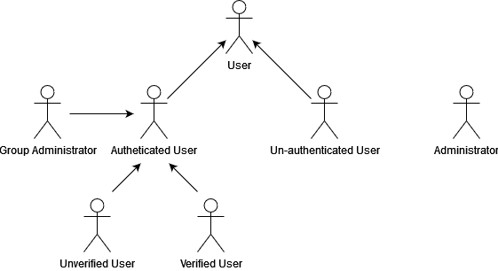

# lbaw2222

# ER: Requirements Specification Component

> Project vision.

## A1: Project Name

The (_PROJECT_NAME) is a project developed by a startup (stakeholders) as a product targeted at college students as a way of helping them integrate easier.

The main goal of the project is the development of a web-based social network for enabling students to interact with each other in an academic context. This is a tool that can be used by students and other members of the academic environment. A team of administrators is defined, which will be responsible for managing complaints and reports, being able to delete/block accounts if needed.

Un-autheticated users are able to use the social network with some limitations, being able to, like an authenticated user, see specific posts and utilize the search functionality.
Users that have an account are able to have the account verified (through a whitelist of emails associated with universities) as students, associating them with their university/faculty, altough this is not mandatory, verification allows users to identify people from their university, they can also edit their profile and manage their account (deleting it even). Groups can be created and managed by the authenticated users with in-group administators being able to enforce their own rules. The users will also be able to add/remove friends and create posts (being able to delete them after too), those posts will appear to their friends through their timeline which can be customized by their owner, furthermore who ever sees a post can comment it and react to it. An essential part of the social network is privacy and thus users can make their profile public or private, being shown only to their friends.

The social network will have an adaptive design so that users can access it through their computer, phone or tablet and have no problems associated with it. The user interface will also be simple and as easier to navigate as possible so that the user can go straight to the point.

---

## A2: Actors and User stories

This artifact contains the specification of the actors and their user stories, serving as agile documentation of the project’s requirements.

### 1. Actors

 

  

  <b> Figure 1: Actors. </b>  

  

| **Identifier**  |  **Description** |
|---|---|
|User|Generic user that has access to public information, such as public profiles and groups. |
|Un-authenticated User|	Un-authenticated user that can register itself (sign-up) or sign-in in the social network. |
|Authenticated User| User that has access to public information aswell as its own and its friends, can create and delete its own posts, create, leave and interact with groups, react and comment posts (aswell as delete its own comments), manage friends and manage friend requests. |
|Group Administrator| User that can manage a group, deleting posts and comments, inviting other users and accepting group access requests. |
|Verified User| User that has its account verified and therefore will be easier to identify as a student. |
|Unverified User| User that does not have its account verified, cannot be identified as a student. |
|Administrator| Can manage posts, delete/block users and receive reports and complaints. |

  <b> Table 1: Actors description. </b>  

  

### 2. User Stories

For the (_PROJECT_NAME) social network, consider the user stories that are presented in the following sections.

#### 2.1. Un-authenticated User

| **Identifier** | **Name** | **Priority** | **Description** |
|---|---|---|---|
| US001 | Log-In_m_ | High | As an _Un-autheticated User_ I want to be able to authenticate into the social network so that I can have access to privileged information. |
| US002 | Sign-Up_m_ | High | As an _Un-autheticated User_ I want to be able to register myself into the social network so that I can authenticate and have access to privileged information. |
| US003 | Recover Password_m_ | Medium | As an _Un-autheticated User_ I want to be able to recover my password. |

  <b> Table 2: <i> Un-authenticated User </i> user stories. </b>  

  

#### 2.2. User

| **Identifier** | **Name** | **Priority** | **Description** |
|---|---|---|---|
| US101 | Search_m_ | High | As a _User_, I want to be able to search through the social network's keywords (posts, comments, users, etc... using exact match, full-text serach, multiple attributes and filters and ordering the results) so that I can find public posts. |
| US102 | View Profile_m_ | High | As a _User_, I want to be able to see a public profile. |
| US103 | See Main Features_m_ | Medium | As a _User_, I want to access the Home page, so that I can see a brief presentation of the website's main features. |
| US104 | See About Us_m_ | Medium | As a _User_, I want to access the About Us page, so that I can get more information about the website and its creators. |
| US105 | See Contacts_m_ | Medium | As a _User_, I want to access contacts, so that I can come in touch with the website creators. |
| US106 | Contextual Error Messages_m_ | Medium | As an _User_ I want to be able to see error messages so that I know what happened or what I did wrong. |
| US107 | Contextual Help_m_ | Medium | As an _User_ I want to be able to ask for help. |
| US108 | See Specific Post_m_ | Low | As an _User_ I want to be able to see a specific public post. |

  <b> Table 3: <i> User </i> user stories. </b>  

  

#### 2.3. Authenticated User
| **Identifier** | **Name** | **Priority** | **Description** |
|---|---|---|---|
| US201 | See Timeline_m_ | High | As an _Autheticated User_ I want to be able to see my timeline, consisting of posts from my friends and the groups I belong to, aswell as deciding its order. |
| US202 | Create a Post_m_ | High | As an _Autheticated User_ I want to be able to create a post. |
| US203 | Edit a Post_m_ | High | As an _Autheticated User_ I want to be able to edit my own post. |
| US204 | Delete a Post_m_ | High | As an _Autheticated User_ I want to be able to delete my own post. |
| US205 | Log Out_m_ | High | As an _Authenticated User_ I want to be able to log out. |
| US206 | Edit Profile_m_ | High | As an _Authenticated User_ I want to be able to edit my profile. |
| US207 | View Private Profile_m_ | High | As an _Authenticated User_, I want to be able to see a private profile if that user is my friend. |
| US208 | Send Friend Requests_m_ | Medium | As an _Autheticated User_ I want to be able to send friend requests in order to add a friend to my friends list. |
| US209 | Remove Friends_m_ | Medium | As an _Autheticated User_ I want to be able to remove friends from my friends list. |
| US210 | Accept Friend Requests_m_ | Medium | As an _Autheticated User_ I want to be able to accept a friend request. |
| US211 | Decline Friend Requests_m_ | Medium | As an _Autheticated User_ I want to be able to decline a friend request. |
| US212 | Comment on a Post_m_ | Medium | As an _Autheticated User_ I want to be able to comment on a post. |
| US213 | Edit a Comment on a Post_m_ | Medium | As an _Autheticated User_ I want to be able to edit my own comment on a post. |
| US214 | Delete a Comment on a Post_m_ | Medium | As an _Autheticated User_ I want to be able to delete my own comment on a post. |
| US215 | Create a Group_m_ | Medium | As an _Authenticated User_ I want to be able to create my own group. |
| US216 | Invite to a Group_m_ | Medium | As an _Authenticated User_ I want to be able to invite friends to a group, if given permission by an administrator. |
| US217 | Accept a Group Invite_m_ | Medium | As an _Authenticated User_ I want to be able to accept a group invite. |
| US218 | Create a Post on a Group_m_ | Medium | As an _Authenticated User_ I want to be able to create a post on a group, if given permission by an administrator. |
| US219 | Leave a Group_m_ | Medium | As an _Authenticated User_ I want to be able to leave a group I belong. |
| US220 | React to a Post_m_ | Medium | As an _Authenticated User_ I want to be able to react to a post. |
| US221 | React to a Comment_m_ | Medium | As an _Authenticated User_ I want to be able to react to a comment. |
| US222 | Check Personal Notifications_m_ | Medium | As an _Authenticated User_ I want to be able check my notifications. |
| US223 | Delete My Account_m_ | Medium | As an _Authenticated User_ I want to be able to delete my account. |
| US224 | Add Profile Picture_m_ | Medium | As an _Authenticated User_ I want to be able to add my profile picture. |
| US225 | View Group's Members_m_ | Medium | As an _Autheticated User_ I want to be able to see a group's members if I'm allowed to. |
| US226 | Receive Likes on a Post Notifications_m_ | Medium | As an _Autheticated User_ I want to be able to receive a notification when a post of mine receives a like so that I can be aware of it happening. |
| US227 | Receive Friend Request Notifications_m_ | Medium | As an _Autheticated User_ I want to be able to receive a notification when I receive a friend request so that I can be aware of it happening. |
| US228 | Change Profile Visibility_m_ | Medium | As a _Authenticated User_, I want to be able to change my profile's visibility. |
| US229 | Appeal for Unblock_m_ | Low | As an _Authenticated User_ I want to be able to appeal for unblock so that I can have access to my account's full functionalities. |
| US230 | View Friends Feed_m_ | Low | As an _Autheticated User_ I want to be able to see my friend's feed. |
| US231 | Tag Friend in a Post_m_ | Low | As an _Autheticated User_ I want to be able to tag a friend on my own post. |
| US232 | Manage a Post's Visibility_m_ | Low | As an _Autheticated User_ I want to be able to manage my own post's visibility. |
| US233 | Tag a Friend on a Comment | Low | As an _Autheticated User_ I want to be able tag a friend on a comment. |
| US234 | Request to Join a Public Group_m_ | Low | As an _Authenticated User_ I want to be able to request to join a public group. |

  <b> Table 4: <i> Autheticated User </i> user stories. </b>  

  

#### 2.3. Group Administrator

| **Identifier** | **Name** | **Priority** | **Description** |
|---|---|---|---|
| US301 | Edit Group Information_m_ | Medium | As a _Group Administrator_, I want to be able to edit the group's information. |
| US302 | Remove Member_m_ | Medium | As a _Group Administrator_, I want to be able to remove a member from the group. |
| US303 | Add to Group_m_ | Medium | As a _Group Administrator_, I want to be able to add an user to a group. |
| US304 | Manage Member Permissions | Low | As a _Group Administrator_, I want to be able to manage who can post, invite, etc... |
| US305 | Remove Post from Group_m_ | Low | As a _Group Administrator_, I want to be able to remove a post from the group. |
| US306 | Change Group Visibility_m_ | Low | As a _Group Administrator_, I want to be able to change the group visibility. |
| US307 | Manage Join Requests_m_ | Low | As a _Group Administrator_, I want to be able to manage the group join requests (accept/decline). |
| US308 | Add Group Administrators | Low | As a _Group Administrator_, I want to be able to make a member a group administrator. |

  <b> Table 5: <i> Group Administrator </i> user stories. </b>  

  

#### 2.3. Administrator

| **Identifier** | **Name** | **Priority** | **Description** |
|---|---|---|---|
| US401 | Find User Account_m_ | High | As a _Administrator_, I want to be able to find an user's account. |
| US402 | View User Account_m_ | High | As a _Administrator_, I want to be able to view an user's account. |
| US403 | Edit User Account_m_ | High | As a _Administrator_, I want to be able to edit an user's account. |
| US404 | Create User Account_m_ | High | As a _Administrator_, I want to be able to create an user account. |
| US405 | Block and Unblock User Accounts_m_ | Medium | As a _Administrator_, I want to be able to block and unblock an user account. |
| US406 | Delete User Account_m_ | Medium | As a _Administrator_, I want to be able to delete an user account. |

  <b> Table 6: <i> Administrator </i> user stories. </b>  

  

### 3. Supplementary Requirements

This section contains business rules, technical requirements and other non-functional requirements on the project.

#### 3.1. Business rules

A business rule defines or constrains one aspect of the business, with the intention of asserting business structure or influencing business behaviour. Business rules often supplement usage or user interface requirements.

| **Identifier** | **Name** |**Description** |
|---|---|---|
| BR001 | Upon Account Deletion | Upon account deletion, shared user data (e.g. comments, reactions) is kept but made anonymous. |
| BR002 | Upon Group Creation | Upon group creation, the group's creator is made it's first group administrator. |

  <b> Table 7: (_PROJECT_NAME) business rules. </b>  

  

#### 3.2. Technical requirements

| **Identifier** | **Name** |**Description** |
|---|---|---|
| TR001 | Availability | The system must be available 99 percent of the time in each 24-hour period. |
| TR002 | Accessibilty | The system must be accessible to anyone that wants to use it, regardless of having any handicap or having a different browser. |
| **TR003** | **Usabilty** | **The system must be simple to use, with a simple, not too overcroweded interface, so that any user can use it without needing to learn how to and without being confused by the visual elements present.** |
| TR004 | Performance | The system must have a response time lower than 2 seconds to ensure the user's attention. |
| **TR005** | **Web Application** | **The system should be implemented as a web application with dynamic pages (HTML5, JavaScript, CSS3 and PHP).   Assuring that the system is accessible without the need to install specific aplications or software, adopting standard web technologies leads to a ready to use social network, accessible to anyone, anywhere.** |
| **TR006** | **Portability** | **The server-side system should work across multiple platforms (Linux, Mac OS, etc...).The system is designed to be used by students at anytime, therefore, it must be available quickly at multiple platforms (platform-independent).** |
| TR007 | Database | The system must have The PostgreSQL database management system must be used, with a version of 11 or higher. |
| TR008 | Security | The system shall protect the users sensitive information from unautherized access through the use of an authentication and verification system. |
| TR009 | Robustness | The system must be prepared to handle runtime errors in order to continue operating. |
| TR010 | Scalability | The system must be prepared for the growth in numbers of users and their actions |
| TR011 | Ethics | The system must respect the ethical principles in software development (for example, personal user details, or data usage, should not be collected nor shared without full acknowledgement and authorization from its owner) |

  <b> Table 8: (_PROJECT_NAME) technical requirements. </b>  

  

#### 3.3. Restrictions

| **Identifier** | **Name** |**Description** |
|---|---|---|
| C001 | Deadline | The system should be ready to use by Christmas. |

  <b> Table 9: (_PROJECT_NAME) project restrictions. </b>  

  
---

## A3: Information Architecture

> Brief presentation of the artefact goals.

### 1. Sitemap

> Sitemap presenting the overall structure of the web application.  
> Each page must be identified in the sitemap.  
> Multiple instances of the same page (e.g. student profile in SIGARRA) are presented as page stacks.

### 2. Wireframes

> Wireframes for, at least, two main pages of the web application.
> Do not include trivial use cases.

#### UIxx: Page Name

#### UIxx: Page Name

---

## Revision history

Changes made to the first submission:
1. Item 1
1. ...

***
GROUP21gg, DD/MM/2021

* André Ismael Ferraz Ávila, up202006767@edu.fe.up.pt (Editor)
* Francisco Maria Lopes Pinto Pimentel Serra, up202007723@edu.fe.up.pt
* ...